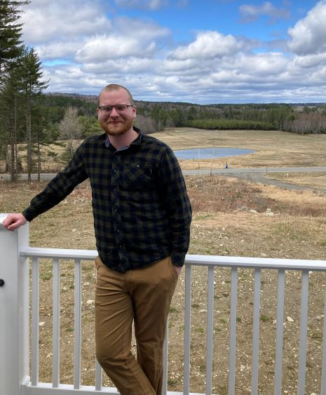

# My Reading Journal For Code Fellows

 
Hi my name's Brennan and I love learning! ❤️

What does a Growth Mindset mean to me?   
Growth mindset is about learning! 📖   
It is about the belief that we can develop our skills further through hard work, good strategies, and input from others.

Three reminders to stay in a growth mindset:

1. __ALWAYS__ have a positive attitude, there will be roadblocks and failures.
2. Do __NOT__ compare yourself to others. Everyone has a different journey.
3. __ALWAYS__ Appreciate the progress that has been made. Appreciation will help foster a positive outlook!

### Here's a link to my [GitHub Portfolio](github.com/brennan-malone) 

> It does not matter how slowly you go so long as you do not stop

-Confucius

[Class 1 Notes](class1.md)  
[Class 2 Notes](class2.md)
